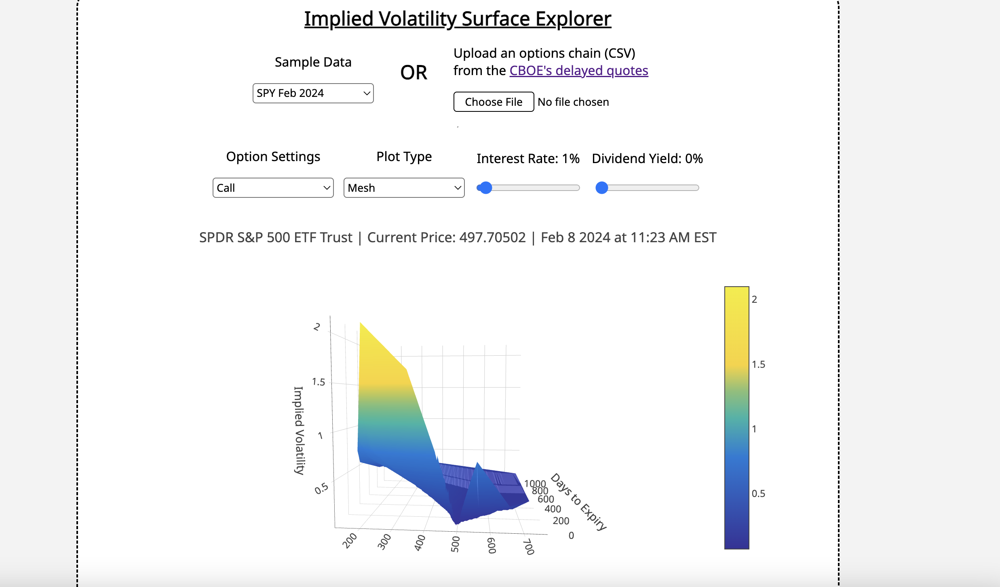

# Implied Volatility Surface Explorer with SIMD and multithreading



A fast, practical Implied Volatility Surface Explorer for SPY and similar options from the [CBOE quotes dashboard](https://www.cboe.com/delayed_quotes/spy/quote_table). Implied Volatility is calculated using [SIMD](https://docs.rs/wide/latest/wide/) and [Rayon](https://github.com/rayon-rs/rayon) and ported to the web with [WASM](https://developer.mozilla.org/en-US/docs/WebAssembly/Rust_to_Wasm). Surfaces are plotted using [Plotly](https://plotly.com/javascript/).

# Usage

### Local

To run locally, first compile from Rust to WASM with (if your machine doesn't support WASM, remove the RUSTFLAGS):

```sh
RUSTFLAGS='-C target-feature=+simd128' wasm-pack build --target web
```

This will generate a `pkg` directory. Then, run the website locally:

```sh
npx serve
```

You may view the sample data or upload the most recent SPY data from CBOE. To do this, visit the [CBOE delayed quotes website](https://www.cboe.com/delayed_quotes/spy/quote_table):


Then, update the Volume, Expiration Type, Options Range, Size, and Expiration filters as desired and scroll to the bottom to Download CSV.


Finally, download the CSV file and upload it to the website.

### Performance and Testing

To run the Rust benchmark locally, comment out these lines in the Cargo.toml

```toml
[lib]
crate-type = ["cdylib"]
```

and then run

```sh
cargo bench
```

Similarily, for tests:

```sh
cargo test
```

# Performance

Calculated on a Macbook M1:

For ~25000 options:

- `bs::implied_vol()` (single): ~23.2ms
- `vol32x8::implied_vol()` (SIMD and multithreaded): ~1ms

# Extensions

1. In real-life applications, the implied volatility calculation should happen in the backend in order to full utilize SIMD instructions and multithreading. Instead of being converted to WASM, the Rust code can be deployed in a backend system and connected to the frontend with HTTP or another protocol.
2. If the Rust web port is kept, multithreading can be utilized in the frontend by enabling `SharedArrayBuffer` in the browser, adding [wasm-bindgen-rayon](https://github.com/RReverser/wasm-bindgen-rayon), and re-compiling to WASM.

# License

[GNU GPL v3](LICENSE)
